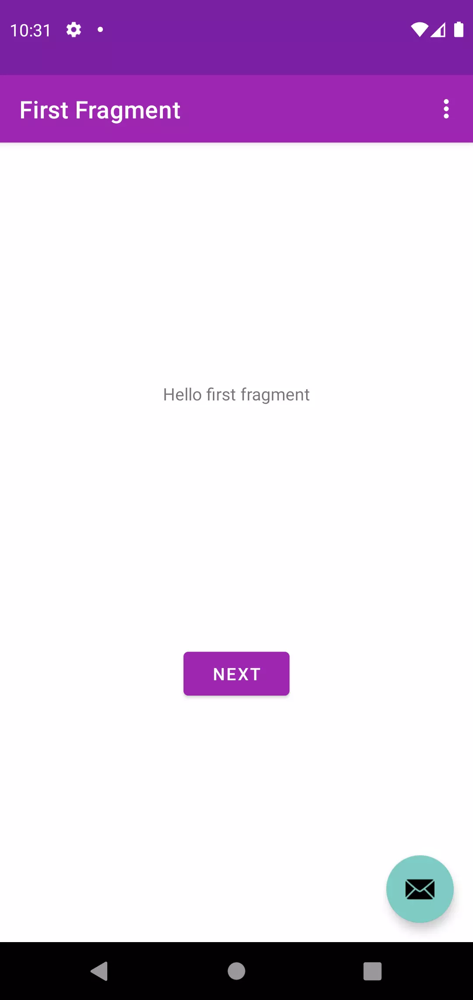

# Beginner App
> purpose of this project is to let people learn implementing dependency / api step by step.
> follow along with numbered branch : 1. 2. 3. and so on


## Current Branch
```sh
Current Branch is Inital UI
```

## Screenshot
```
It is basically NewProject-> Phone and Tablet -> Basic Activity
```


## Whats in this branch
| implementation | package |
| ------ | ------ |
| Initial Ui |  |


## ✨Happy coding ✨
