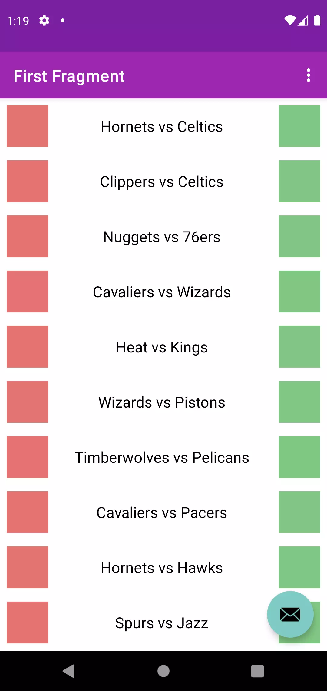

# Beginner App
> purpose of this project is to let people learn implementing dependency / api step by step.
> follow along with numbered branch : 1. 2. 3. and so on


## Current Branch
```sh
Current Branch is recyclerview
```

## Screenshot
```
Add Dummy Item to RecyclerView
```


## Whats in this branch
| implementation | version |
| ------ | ------ |
| Initial Ui | default project setting |
| recyclerview | 1.2.1 |
| retrofit | 2.9.0 |
| -> retrofit converter moshi | 2.9.0 |
| -> moshi-kotlin | 1.13.0 |


## Additional Dependencies
| implementation | version |
| ------ | ------ |
| ktx | 1.8.0 |
| appcompat | 1.5.0 |
| material | 1.6.1 |
| constraintLayout | 2.1.4 |
| navigation | 2.5.1 |


## ✨Happy coding ✨
